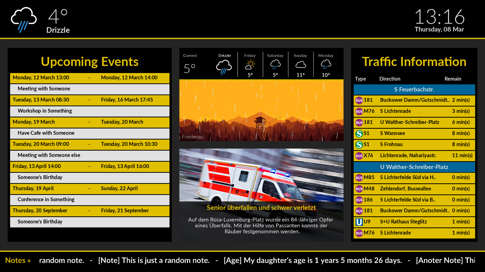

# Screenage
Screenage is a personal digital signage software that displays current weather, time, events, news and traffic. It is personalized to be used in Berlin. However, with some efforts, you can personalize it as you want.

## Screenshot


## Getting Started
Screenage is written using `python3` and [info-beamer](https://info-beamer.com/). So you need them both to be installed on your computer.

### Python3 Modules
The full list of required modules is provided in `requirements.txt`. You can install them by typing
```
$ pip3 install -r requirements.txt
```

### Setup your Location
Screenage needs to know your location to provide traffic and weather information. You can provide Screenage with your location using the script `/scripts/get_location`. Just type
```
$ python3 get_location <your location>
```

### Notes
Screenage takes the lines from a given file and renders them into the moving text at the bottom of the software window. 
To provide Screenage with that file, please edit `/scripts/config.ini` and add the path of that file to it. 

### Weather API Key
Screenage uses OpenWeatherMap API to get weather data. Thus, you need to have an API key. You can get one from [this site](http://openweathermap.org) (it's free.)
After getting a key, please edit `/scripts/config.ini` and add the key to it.

### Google Calendar
To display your Google calendar events, copy your `client_secret.json` file to `/scripts/gcalendar`, and run
```
$ python3 /scripts/gcalendar/gcalendar.py
```
Then follow the instructions. You need to do that just for the first time you run Screenage.
Learn more about `client_secret.json` [here](https://developers.google.com/google-apps/calendar/quickstart/go)

### Running the Software
Finally, to start Screenage, just type
``` 
$ bash start.sh
```

## To-Do List
* Write a better documentation.
* Screenage Modules:
 * Add more modules.
 * Add other News modules.


